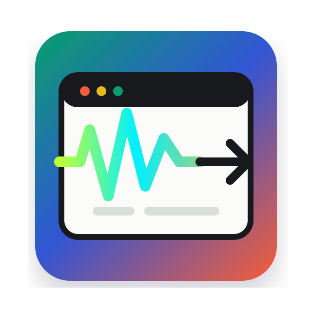
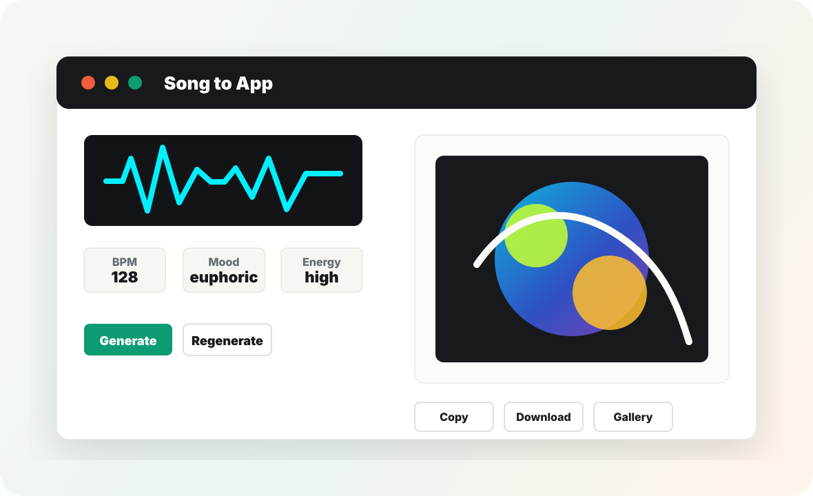
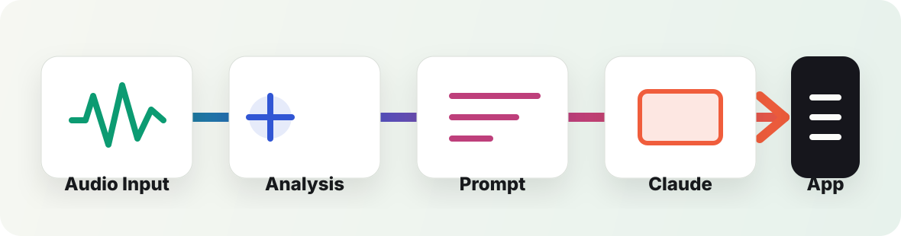

<p align="center">
  
</p>

<h1 align="center">Song to App</h1>

<p align="center">
  A single-page React experiment that listens to a song, analyzes its musical character, and asks Claude to generate a unique mini web app that feels like the track.
</p>

<p align="center">
  
  
  
  
</p>



## What It Does

Song to App turns music into software. Drop in an audio file or record from your microphone, then the app extracts tempo, energy, frequency balance, mood, palette, optional vocal themes, and a rough genre guess. Those traits become a structured prompt for Anthropic Claude, which returns a self-contained HTML/CSS/JS mini app rendered immediately in a sandboxed iframe.

The generated app can become a visualizer, tiny game, interactive poem, mood board, generative artwork, or any other browser-native interpretation of the song.



## Pipeline

```text
Audio Input -> Analysis -> Prompt Synthesis -> Claude API -> Rendered App
```

## Features

- Upload `.mp3`, `.wav`, `.m4a`, or other browser-supported audio files.
- Record directly from the microphone with `MediaRecorder`.
- Load a built-in sample analysis to explore the app without audio or API keys.
- Draw a live waveform while recording and a static waveform after analysis.
- Estimate BPM with peak detection over a smoothed energy envelope.
- Classify energy from RMS amplitude.
- Estimate dominant frequency range with Web Audio filters.
- Derive mood and color palette from tempo plus energy.
- Optionally send audio to Whisper for lyrics and vocal themes.
- Generate a structured Claude prompt from the analysis.
- Stream Claude output and parse the returned HTML.
- Generate a local demo app without API keys for first-run testing.
- Render the generated app inline with `iframe srcDoc`.
- Regenerate with a variation seed and user feedback.
- Copy or download the generated HTML.
- Copy or download the analysis JSON.
- Save recent generated apps in `localStorage`.

## Mood Mapping

| BPM | Energy | Mood | Palette |
| --- | --- | --- | --- |
| `<70` | low | melancholic | muted blues, grays |
| `<70` | high | tense | deep reds, dark greens |
| `70-120` | low | chill | pastels, soft greens |
| `70-120` | high | uplifting | warm yellows, oranges |
| `>120` | low | dreamy | purples, soft pinks |
| `>120` | high | euphoric | neons, electric blues |

## Quick Start

This project is intentionally just one HTML file. No package install or build step is required.

```bash
python -m http.server 5173
```

Then open:

```text
http://127.0.0.1:5173/
```

Serving from localhost is recommended because microphone permissions work more reliably from a secure context or localhost than from a plain `file://` URL.

## Demo Mode

Click **Try Sample** to load a built-in analysis, or analyze your own song first. Then click **Demo Generate** to create a local generative visual app without calling Claude. This is useful for testing the generation flow, gallery saving, copy/download controls, and iframe rendering before API keys or proxies are configured.

## API Keys And Proxies

The app has four settings:

| Field | Use |
| --- | --- |
| Anthropic Key | Direct local testing with Claude. |
| Claude Proxy URL | Production-safe endpoint that forwards to Anthropic. |
| OpenAI Key | Direct local testing with Whisper transcription. |
| Whisper Proxy URL | Production-safe endpoint that forwards to OpenAI. |

For private local experiments, you can paste keys into the key fields. They are stored only in the current tab's `sessionStorage`.

For a deployed public app, use proxy URLs instead. Do not expose real API keys in browser source code, public environment variables, or committed files.

### Expected Proxy Behavior

The Claude proxy should accept the same JSON body the app sends and forward it to:

```text
https://api.anthropic.com/v1/messages
```

The Whisper proxy should accept `multipart/form-data` and forward it to:

```text
https://api.openai.com/v1/audio/transcriptions
```

Each proxy should add the provider API key on the server side, then return the provider response to the browser.

An optional Cloudflare Worker proxy is included at [`proxy/cloudflare-worker.js`](./proxy/cloudflare-worker.js). See [`proxy/README.md`](./proxy/README.md) for local development and secret setup.

## GitHub Pages

This repo includes a GitHub Actions workflow at [`.github/workflows/pages.yml`](./.github/workflows/pages.yml). To publish the app:

1. In GitHub, open **Settings -> Pages**.
2. Set **Source** to **GitHub Actions**.
3. Push to `main` or run the workflow manually.

Because the app is static, the deployed site is the same `index.html` that runs locally.

## Claude Prompt Shape

The generated prompt includes:

- Mood
- Energy
- BPM
- Color palette
- Lyric themes or instrumental keywords
- Guessed genre
- Dominant frequency range
- User feedback and variation seed
- Requested app type

Claude is instructed to return only one complete HTML file using vanilla HTML, CSS, and JavaScript with no external libraries or network resources.

## Project Structure

```text
.
|-- .github/workflows/pages.yml
|-- index.html
|-- LICENSE
|-- README.md
|-- assets/
    |-- app-preview.svg
    |-- logo.svg
    |-- pipeline.svg
    `-- social-preview.svg
`-- proxy/
    |-- cloudflare-worker.js
    `-- README.md
```

## Browser Support

Modern Chromium, Firefox, and Safari should support the core flow. Exact recording format support can vary by browser because `MediaRecorder` MIME support is platform-dependent.

## Limitations

- BPM detection is heuristic and may be wrong for quiet intros, tempo changes, swung rhythm, or sparse percussion.
- Genre detection is intentionally lightweight and based on tempo, energy, and frequency profile.
- Whisper transcription requires an OpenAI key or proxy.
- Claude generation requires an Anthropic key or proxy. Demo generation works without either.
- Direct API calls from the browser are for local testing only.

## Roadmap

- Add Vercel and Netlify proxy templates.
- Add visual waveform thumbnails to saved gallery items.
- Add Spotify URL support through Spotify audio features.
- Add export bundles with metadata and preview images.
- Add stronger beat tracking and onset detection.

## License

MIT. See [LICENSE](./LICENSE).

## Credits

Built with browser-native audio APIs, React via UMD scripts, OpenAI Whisper for optional transcription, and Anthropic Claude for creative app generation.
